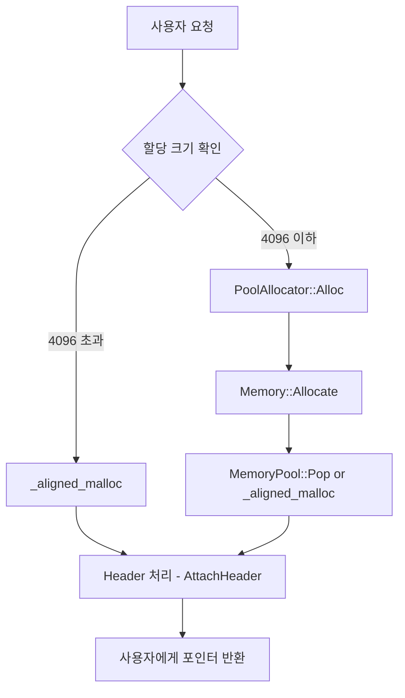

# 🧠 메모리 관리

이 프로젝트는 게임 서버 또는 고성능 애플리케이션에서 사용할 수 있는 **커스텀 메모리 할당 **입니다.  
`BaseAllocator`, `StompAllocator`, `PoolAllocator`, `Memory`, `MemoryPool` 등의 계층으로 구성되어 있습니다.

---

## 📊 전체 흐름도

--------------------------------------------
메모리 할당 흐름
1. 사용자 요청
사용자가 메모리 할당을 요청합니다.

2. 할당 크기 확인
Memory::Allocate(size)에서 요청 크기를 기준으로 분기합니다.

기준값: MAX_ALLOC_SIZE = 4096 bytes

요청 크기	할당 경로	설명
크기 ≤ 4096 bytes	PoolAllocator 경로	메모리 풀에서 할당 처리
크기 > 4096 bytes	일반 할당 경로	직접 _aligned_malloc() 호출

3. PoolAllocator 경로 (크기 ≤ 4096 bytes)
_poolTable[size]에서 O(1) 시간에 적절한 MemoryPool 선택

선택된 풀에서 Pop() 호출하여 메모리 블록 획득

풀이 부족하면 _aligned_malloc()으로 새 블록 할당

할당된 블록 앞에 MemoryHeader를 붙여 관리

4. 일반 할당 경로 (크기 > 4096 bytes)
MemoryPool 관리 범위를 벗어나므로 _aligned_malloc() 호출

할당된 메모리 앞에 MemoryHeader 추가

5. 공통 처리
모든 메모리 블록은 MemoryHeader와 함께 관리됨

해제 시 DetachHeader()를 호출해 헤더 분리

크기에 따라 다시 풀로 반납하거나 _aligned_free()로 해제

핵심 컴포넌트
컴포넌트	역할
MemoryPool	크기별로 미리 할당된 메모리 블록을 재사용 (lock-free push/pop)
Memory	요청 크기에 맞는 메모리 풀 선택 및 할당 관리
PoolAllocator	메모리 할당 시스템 진입점
MemoryHeader	메모리 블록 앞에 붙는 메타정보, 추적 및 해제 용도
_aligned_malloc	풀에 여유가 없거나 크기 초과 시 직접 메모리 할당

요약
메모리 풀을 활용해 작은 크기 할당을 빠르고 효율적으로 처리

큰 크기는 직접 시스템 할당으로 처리하여 관리 단순화

모든 할당 블록은 헤더로 관리되어 안전한 추적 및 해제 보장

lock-free 구조로 멀티스레드 환경에 적합

